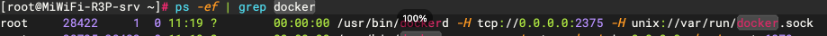
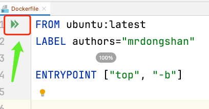

### 适配elk

##### 1、pom中添加依赖
```angular2html
<dependency>
    <groupId>net.logstash.logback</groupId>
    <artifactId>logstash-logback-encoder</artifactId>
    <version>5.2</version>
</dependency>
```

##### 2、加入[logback-spring.xml](src%2Fmain%2Fresources%2Flogback-spring.xml)文件
与普通的logback-spring.xml文件不同的是加入了
```angular2html
<appender name="LOGSTASH" class="net.logstash.logback.appender.LogstashTcpSocketAppender">
    <!--可以访问的logstash日志收集端口-->
    <destination>172.25.233.219:5044</destination>
    <encoder charset="UTF-8" class="net.logstash.logback.encoder.LogstashEncoder"/>
</appender>
```
和
```angular2html
<root level="info">
    <appender-ref ref="LOGSTASH"/>
</root>
```

##### 3、然后在application.yml中添加
```angular2html
logging:
  level:
    com.mrdongshan.elk: INFO
```

### 整合 Docker 

##### 1、加入Dockerfile

---

```angular2html
FROM konajdk/konajdk:8-tlinux

MAINTAINER mrdongshan

ENV TZ=Asia/Shanghai
ENV JAVA_OPTS="-Xms1024m -Xmx1024m -Djava.security.egd=file:/dev/./urandom"

RUN ln -sf /usr/share/zoneinfo/$TZ /etc/localtime && echo $TZ > /etc/timezone

RUN mkdir -p /demo-elk

WORKDIR /demo-elk

EXPOSE 8122

ADD ./target/demo-elk-0.0.1-SNAPSHOT.jar ./

CMD sleep 120;java $JAVA_OPTS -jar demo-elk-0.0.1-SNAPSHOT.jar
```

##### 2、配置 idea 将镜像打包到远程 docker 

----

###### 配置远程服务器上的Docker允许远程访问

a、修改`Docker`的配置文件
```bash
vim /usr/lib/systemd/system/docker.service
```
修改如下内容
```bash
ExecStart=/usr/bin/dockerd -H fd:// --containerd=/run/containerd/containerd.sock
# 修改为
ExecStart=/usr/bin/dockerd -H tcp://0.0.0.0:2375 -H unix://var/run/docker.sock
```

b、重启`Docker`
```
systemctl daemon-reload
systemctl restart docker
```

c、检查进程
```bash
ps -ef | grep docker
# Docker守护进程打开一个HTTP Socket,这样才能实现远程通信
```


d、开启`Docker`所在服务器的防火墙
```bash
firewall-cmd --zone=public --add-port=2375/tcp --permanent
systemctl restart firewalld.service
firewall-cmd --reload
```

e、测试连接
```
docker -H tcp://172.25.233.219:2375 version
```
如果提示下面红色的区域的信息，就说明 **没有成功**


###### IDEA配置远程服务器docker地址

`IDEA`所在的主机上必须存在`Docker`，即使没有启动。

然后点击`Dockerfile`的启动


配置Docker信息，右上角可以看到这个启动项


其中`image tag`是必须的，`Run`后面的`Modify`是可选的，例如我这
里就选择了`Bind ports`来指定容器与主机共用的端口，从而达到从外界访问容器的目的。


